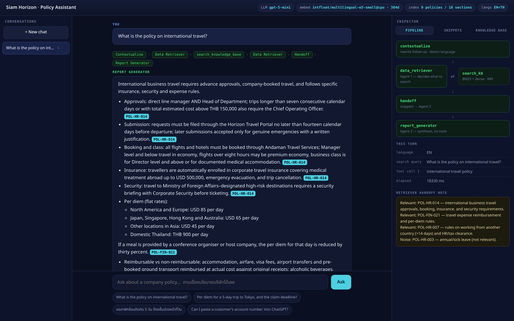
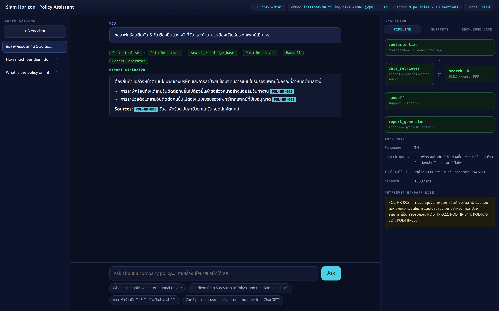
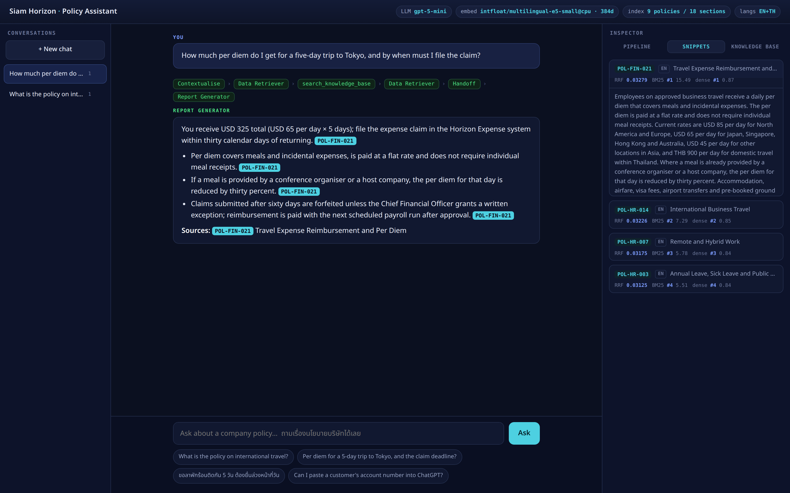
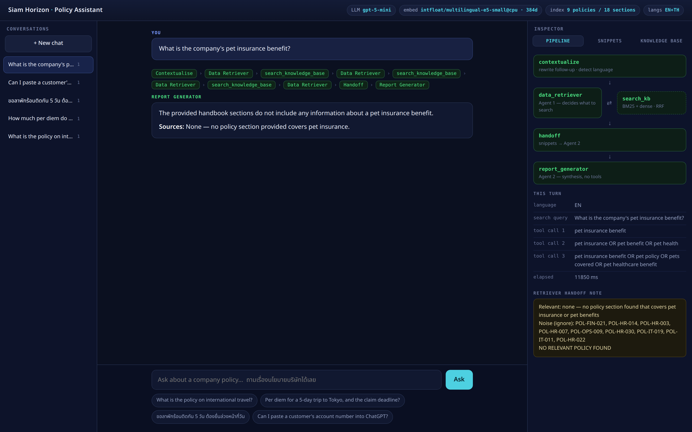
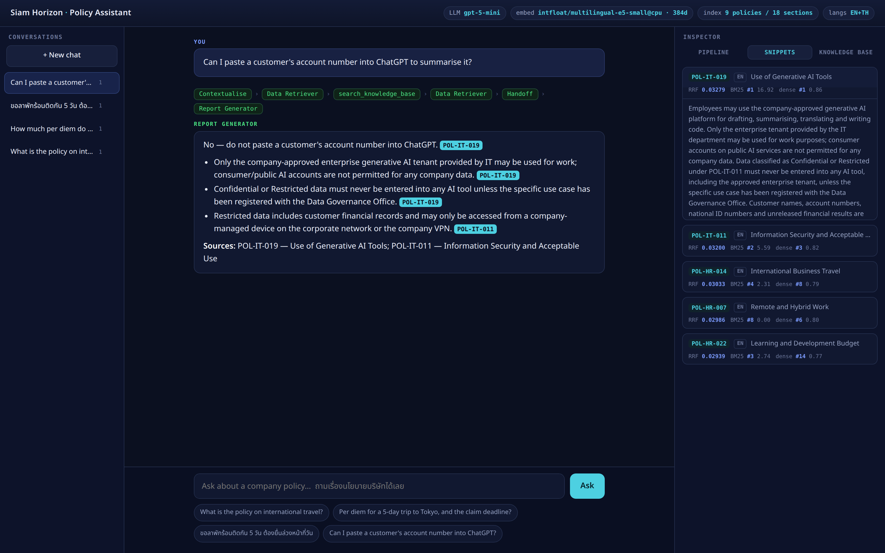
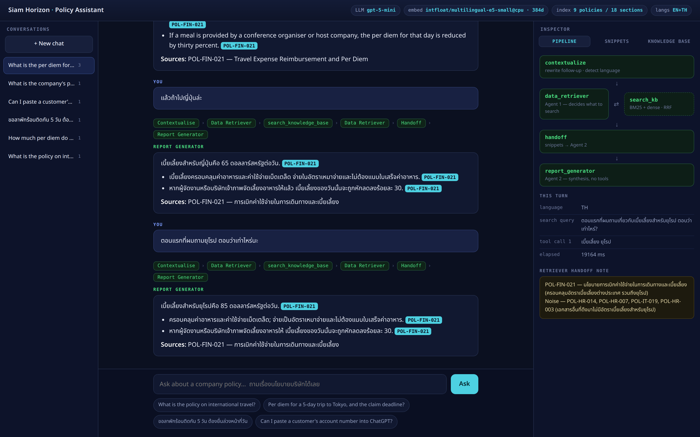

# Siam Horizon Policy Assistant

A two-agent **LangGraph** system that answers employee questions about a company
policy handbook using **Retrieval-Augmented Generation**.

A *Data Retriever* agent searches the knowledge base with a custom hybrid search
tool and hands raw policy sections to a *Report Generator* agent, which turns
them into a cited, non-redundant answer. The knowledge base is bilingual
(Thai + English) and questions can be asked in either language.

It ships with a CLI, a browser UI that visualises the pipeline as it runs, and a
test suite.

```
┌──────────────┐   standalone   ┌────────────────┐   snippets   ┌──────────────────┐
│ contextualize│──── query ────▶│ Data Retriever │──── only ───▶│ Report Generator │
│  rewrite +   │                │   (Agent 1)    │              │    (Agent 2)     │
│ detect lang  │                │  ⇅ search tool │              │     no tools     │
└──────────────┘                └────────────────┘              └──────────────────┘
```

---

## 1. How this maps to the assignment

| Requirement | Where it lives |
| --- | --- |
| Framework: LangChain / LangGraph | `langgraph.StateGraph` in [`src/graph.py`](src/graph.py) |
| `knowledge_base.txt` with sample content | [`knowledge_base.txt`](knowledge_base.txt) — 9 policies × EN + TH |
| **Data Retriever**: retrieval expert, does not answer | [`src/agents/retriever.py`](src/agents/retriever.py), prompt in [`src/agents/prompts.py`](src/agents/prompts.py) |
| **Its tool**: custom Python function that reads the file and searches it | [`src/agents/tools.py`](src/agents/tools.py) → [`src/retrieval/`](src/retrieval/) |
| Retriever output: raw relevant chunks | `handoff` node in [`src/graph.py`](src/graph.py) collects tool artifacts |
| **Report Generator**: synthesises, no tools | [`src/agents/reporter.py`](src/agents/reporter.py) |
| Sequential orchestration, retriever output → generator input | graph edges `data_retriever → handoff → report_generator` |
| Coordination pattern | **agent-as-tool** for search, explicit **handoff** node between the two agents |
| Run with a sample query | `python main.py "What is the policy on international travel?"` |
| Screenshots of several queries | [`screenshots/`](screenshots/) |

## 2. Quick start

```bash
git clone <this-repo> && cd policy-rag-agents

python3 -m venv .venv && source .venv/bin/activate
pip install -r requirements.txt

cp .env.example .env      # then put your OpenAI key in OPENAI_API_KEY
```

The first run downloads the embedding model (`intfloat/multilingual-e5-small`,
~470 MB) once and caches the document vectors in `.cache/`.

### Command line

```bash
python main.py "What is the policy on international travel?"   # one-shot
python main.py --trace "How much per diem in Tokyo?"           # + retrieval scores
python main.py --demo                                          # five sample queries
python main.py                                                 # interactive, remembers context
python main.py --thread my-chat                                # resume a stored conversation
```

### Web UI

```bash
python server.py     # http://localhost:8100
```

The page shows the graph lighting up node by node, the queries the retriever
chose, every retrieved snippet with its BM25 / dense / RRF scores, the handoff
note, and the streamed final answer. Conversations are listed in the sidebar and
survive a restart.

### Tests

```bash
pip install -r requirements-dev.txt
pytest                      # 30 offline tests, no API key needed
```

## 3. The RAG mechanism

`search_knowledge_base` is the only tool the Data Retriever can call. Behind it:

1. **Section-aware chunking** — `knowledge_base.txt` is split on
   `### <POLICY_ID> | <LANG> | <TITLE>` markers, so every chunk is a complete
   policy with its identifier intact. That identifier is what makes the final
   answer citable as `[POL-HR-014]`.
2. **Lexical search — BM25** (`src/retrieval/bm25.py`, ~60 lines of NumPy).
   Catches exact literals: policy codes, `Andaman Travel Services`, `per diem`.
   Thai has no word boundaries, so Thai runs are segmented with PyThaiNLP's
   `newmm` before indexing — without this step BM25 scores near zero on every
   Thai query.
3. **Semantic search — dense embeddings** (`intfloat/multilingual-e5-small`).
   Catches paraphrase, and crucially works *across* languages: a Thai question
   about `เบี้ยเลี้ยง` retrieves the English *per diem* section even though the
   two share no characters.
4. **Fusion — Reciprocal Rank Fusion.** The two rankings are merged by rank
   rather than by score (`1/(k + rank)`), so no score normalisation is needed
   and neither ranker can dominate through raw magnitude.
5. **Edition de-duplication.** Each policy exists twice, once per language.
   Returning both would feed the Report Generator the same facts twice, so only
   one edition survives per policy — preferring the language the employee wrote
   in.

Inspect any of this without spending a token:

```bash
python scripts/inspect_retrieval.py "เบิกค่าเดินทางได้เท่าไหร่"
```

```
QUERY [th]  เบี้ยเลี้ยงเดินทางไปญี่ปุ่นได้วันละเท่าไหร่
1. [POL-FIN-021 · th] การเบิกค่าใช้จ่ายในการเดินทางและเบี้ยเลี้ยง
   rrf=0.03279  bm25=#1 (10.491)  dense=#1 (0.860)
2. [POL-HR-014 · th] การเดินทางไปปฏิบัติงานต่างประเทศ
   rrf=0.03226  bm25=#2 (4.134)   dense=#2 (0.815)
```

## 4. Design decisions

**Why the retriever is an agent and not a function call.** A fixed vector lookup
runs once with whatever the user typed. The retriever here decides *how many*
searches to run and *what to search for*: it splits "per diem **and** the claim
deadline" into separate searches, and it widens the query when the first attempt
comes back weak — visible in the out-of-scope screenshot, where it tries three
phrasings before reporting `NO RELEVANT POLICY FOUND`. It is capped at
`MAX_SEARCH_ROUNDS = 3` so a confused model cannot loop.

**Why the two agents do not share a message list.** The retriever works in its
own `retriever_messages` scratchpad, cleared at the start of every turn. Only the
snippets it selected — never its tool calls or its reasoning — reach the Report
Generator. That is what makes this a genuine handoff rather than one long chain
of thought, and it keeps the reporter's context free of retrieval noise.

**Why there is a `contextualize` node.** The assignment is single-shot, but a
usable assistant is not. "แล้วถ้าไปญี่ปุ่นล่ะ" retrieves nothing on its own, so
the node rewrites follow-ups into standalone queries using the conversation
history before retrieval runs. It skips the LLM call entirely on the first turn.

**Why grounding is enforced by construction.** The Report Generator has no tools
and never sees `knowledge_base.txt` — only the snippets handed to it. Combined
with a prompt that forbids outside knowledge and requires a `[POL-xxx]` citation
per claim, every sentence in the answer is traceable to a retrieved section, and
questions the handbook does not cover get a plain "not covered" instead of an
invention.

**Why no vector database.** Nine policies is 18 chunks. A dense NumPy matrix and
a dot product beat FAISS or Chroma on both latency and dependency count at this
size; `HybridRetriever.from_settings()` caches the vectors to `.cache/` so
startup is instant after the first run.

**Why the language is detected with a regex, not the LLM.** A character-ratio
check is deterministic, instant and free, and it is right on Unicode's terms.
Spending a round trip per turn on a question Unicode already answers is waste.

## 5. Project layout

```
knowledge_base.txt          the knowledge base — 9 policies, EN + TH editions
main.py                     CLI entry point
server.py                   FastAPI + SSE, imports the same compiled graph
web/index.html              the entire UI: no build step, no CDN, no node_modules
src/
  config.py                 settings from .env, provider-agnostic
  graph.py                  the LangGraph StateGraph — orchestration lives here
  llm.py                    model factory (OpenAI-compatible base URL)
  sessions.py               chat-session registry for the sidebar
  utils.py                  language detection
  agents/
    prompts.py              both agents' system prompts, in one readable place
    retriever.py            Agent 1 — tool-bound, forbidden from answering
    reporter.py             Agent 2 — tool-free synthesiser
    tools.py                the search_knowledge_base tool
  retrieval/
    chunker.py              section-aware chunking
    tokenizer.py            Thai + English tokenisation for BM25
    bm25.py                 Okapi BM25 in NumPy
    embedder.py             local (sentence-transformers) or OpenAI backend
    hybrid_index.py         RRF fusion, edition de-duplication
  ratelimit.py              per-client and per-day throttling for the public host
scripts/
  inspect_retrieval.py      retrieval scores without the LLM
  capture_screenshots.py    regenerates screenshots/
deploy/                     systemd unit + Cloudflare Tunnel install script
tests/                      30 offline tests
```

## 6. Screenshots

| | |
| --- | --- |
|  |  |
| The assignment's sample query. The pipeline panel shows each node as it ran. | The same system answering in Thai — retrieval, synthesis and output all switch language. |
|  |  |
| A question spanning two policies, with per-snippet BM25 / dense / RRF scores. | Out of scope: the retriever tries three phrasings, then the reporter declines instead of inventing. |
|  |  |
| A question that only resolves by combining the AI policy with the data-classification policy. | Multi-turn memory: a Thai follow-up and a back-reference to the first question. |

## 7. Configuration

Everything is driven by `.env` (see `.env.example`):

| Variable | Default | Notes |
| --- | --- | --- |
| `LLM_MODEL` | `gpt-5-mini` | any chat model on the configured endpoint |
| `OPENAI_BASE_URL` | `https://api.openai.com/v1` | point at vLLM/Ollama to run offline |
| `EMBEDDING_BACKEND` | `local` | `openai` to skip the model download |
| `EMBEDDING_DEVICE` | `auto` | `auto` picks CUDA when a usable driver is present |
| `RETRIEVAL_TOP_K` | `4` | sections returned per search |
| `RRF_K` | `60` | RRF damping constant |
| `RATE_LIMIT_PER_IP` | `10` | chat requests per client per window; `0` disables |
| `RATE_LIMIT_WINDOW_SECONDS` | `300` | length of that window |
| `RATE_LIMIT_DAILY_TOTAL` | `200` | ceiling for the whole service per day; `0` disables |

Because the LLM is addressed through an OpenAI-*compatible* base URL, moving the
whole system onto a local GPU is a change to `OPENAI_BASE_URL` and `LLM_MODEL` —
no code change.

## 8. Deployment

`deploy/install.sh` publishes the app behind an existing Cloudflare Tunnel:

```bash
sudo bash deploy/install.sh      # -> https://bbl.mcp-digitalstudio.com
```

It installs `deploy/policy-assistant.service` (the app, bound to loopback only —
the tunnel reaches it over localhost, so nothing needs to listen on the LAN),
then adds a single ingress rule to `/etc/cloudflared/config.yml`. The tunnel
config is backed up and validated before `cloudflared` is restarted, and the
script prints the rollback command on the way out.

**Rate limiting matters here.** A public deployment shares one API key with
every visitor, so `/api/chat` is throttled per client *and* against a daily
total for the whole service. The check runs before the graph does, so a rejected
request costs nothing, and the browser shows the limit message instead of
silently hanging.
